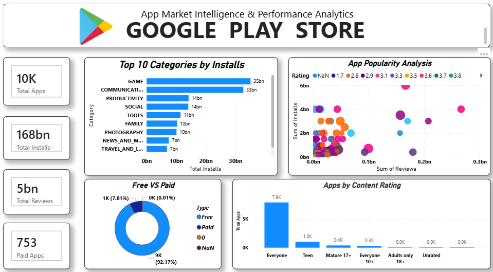
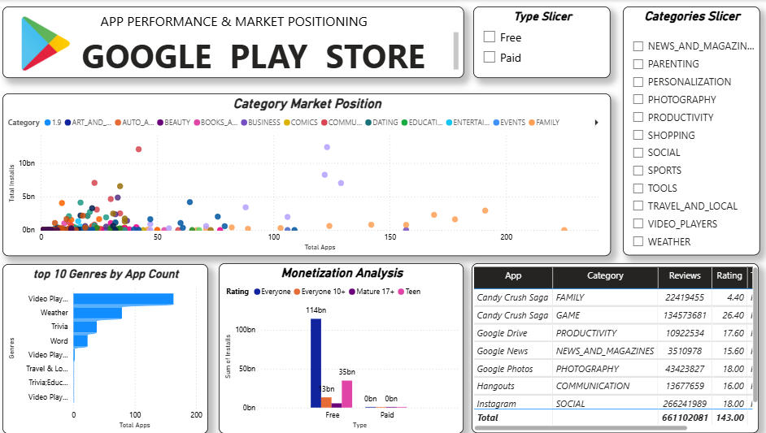

# **📱 Google Play Store – App Market Intelligence & Performance Analytics**

An interactive data analytics project that explores the Google Play Store market to understand **app performance, category trends, user engagement, and monetization opportunities**.

The project features **two interactive dashboards** built to analyze app popularity, installs, ratings, reviews, content ratings, and market positioning through data visualization.

---

## **📑 Table of Contents**

- Dataset Overview
- Business Questions
- Dashboard 1
- Dashboard 2
- Technologies Used
- Project Structure
- How to Run
- Key Takeaways
- Future Scope
- Author

---

## **🗂️ Dataset Overview**

- **Source:** Google Play Store Apps dataset (Kaggle)
- **Records:** App-level data (name, category, rating, reviews, installs, size, type, price, content rating, genre)
- **Cleaning steps:** Removed duplicates, handled missing values, converted installs/price/size to numeric, standardized categories

---

## **❓ Business Questions**

- Which categories dominate the market by installs?
- Do more reviews and installs lead to higher ratings?
- How do free and paid apps differ in performance?
- Which content ratings and genres offer the best monetization opportunity?

---

## **📊 Dashboard 1: App Market Intelligence & Performance Analytics**

This dashboard provides an overview of the Google Play Store ecosystem, highlighting app distribution, popularity, and performance.



**Key Insights:**

- Total apps, installs, reviews, and paid app analysis
- Top 10 categories ranked by total installs
- App popularity analysis based on installs and reviews
- Free vs. paid app distribution
- App distribution by content rating

**🤖 Dashboard 1 prompt:**

```text
Create an interactive dashboard titled "App Market Intelligence & Performance Analytics" using the Google Play Store dataset (columns: App, Category, Rating, Reviews, Installs, Type, Price, Content Rating, Genres).

Layout:
1. Top row: 4 KPI cards - Total Apps, Total Installs, Total Reviews, Total Paid Apps.
2. Left: Horizontal bar chart of Top 10 Categories by total installs (sorted descending).
3. Center: Scatter/bubble chart of installs vs reviews (bubble size = rating) to show app popularity.
4. Right top: Donut chart for Free vs Paid apps distribution.
5. Right bottom: Pie/bar chart for app distribution by Content Rating.

Design: dark professional theme, Google Play green (#01875f) as accent color, clean fonts, tooltips on hover, consistent color palette, proper titles and legends, and the layout should be responsive.
Use Python (Pandas, Plotly) or Power BI. Clean the data first (convert Installs and Price to numeric, drop duplicates, fill missing ratings).
```

---

## **📈 Dashboard 2: App Performance & Market Positioning**

This dashboard focuses on category-level market positioning, app distribution, and monetization trends, with interactive filters for deeper analysis.



**Key Insights:**

- Category-wise market positioning and performance
- Interactive filters for free and paid apps and categories
- Top 10 genres by app count
- Monetization analysis by content rating
- Detailed app-level comparison of categories, reviews, and ratings

**🤖 Dashboard 2 prompt:**

```text
Create an interactive dashboard titled "App Performance & Market Positioning" using the Google Play Store dataset (columns: App, Category, Rating, Reviews, Installs, Type, Price, Content Rating, Genres).

Layout:
1. Left sidebar filters: App Type (Free/Paid) and Category (multi-select dropdown). All visuals must update dynamically.
2. Main chart: Market positioning scatter plot - X-axis = average rating, Y-axis = total installs, bubble size = number of apps, colored by category.
3. Bar chart: Top 10 Genres by app count.
4. Chart: Monetization analysis by Content Rating (paid apps count and average price).
5. Bottom: Detailed data table with App, Category, Reviews, Rating, Installs, Type - sortable and searchable.

Design: same dark theme and green accent as Dashboard 1 for consistency, hover tooltips, clear axis labels, rounded cards, and a responsive layout.
Use Python (Pandas, Plotly Dash/Streamlit) or Power BI/Tableau.
```

---

## **🛠️ Technologies Used**

- **Python**
- **Pandas & NumPy**
- **Matplotlib & Seaborn**
- **Data Visualization**
- **Dashboard & Interactive Filtering**
- **SQL**

---

## **▶️ How to Run**

```bash
git clone https://github.com/your-username/Google-Play-Store-Analytics.git
cd Google-Play-Store-Analytics
pip install -r requirements.txt
jupyter notebook notebooks/analysis.ipynb
```

---

## **💡 Key Takeaways**

- A few categories capture the majority of total installs
- Free apps dominate the market, while paid apps are a small niche
- High reviews and installs generally indicate strong market traction
- Content rating strongly influences audience size and monetization potential

---

## **🚀 Future Scope**

- Add sentiment analysis on user reviews
- Build a rating prediction model using Machine Learning
- Deploy the dashboard using Streamlit or Power BI Service
- Add time-series trend analysis using the "Last Updated" column

---

## **🎯 Project Objective**

To transform Google Play Store data into **meaningful insights** that help understand app market trends, user engagement, category performance, and monetization patterns.

---

**GitHub**
💻 (https://github.com/palaktonke06-a11y)

⭐ *If you found this project useful, please give it a star!*
